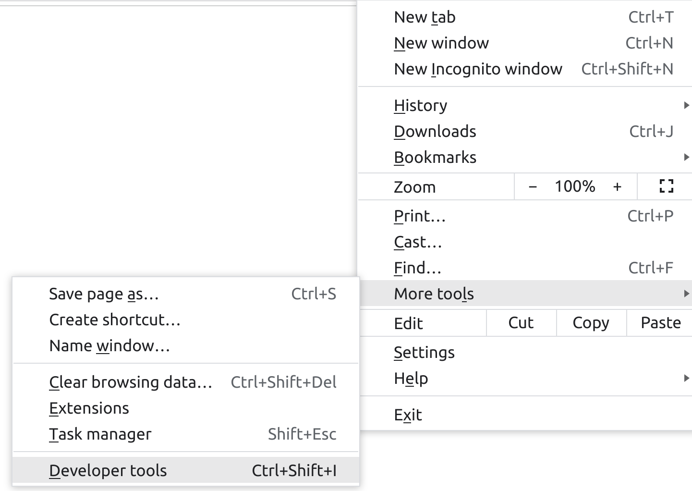
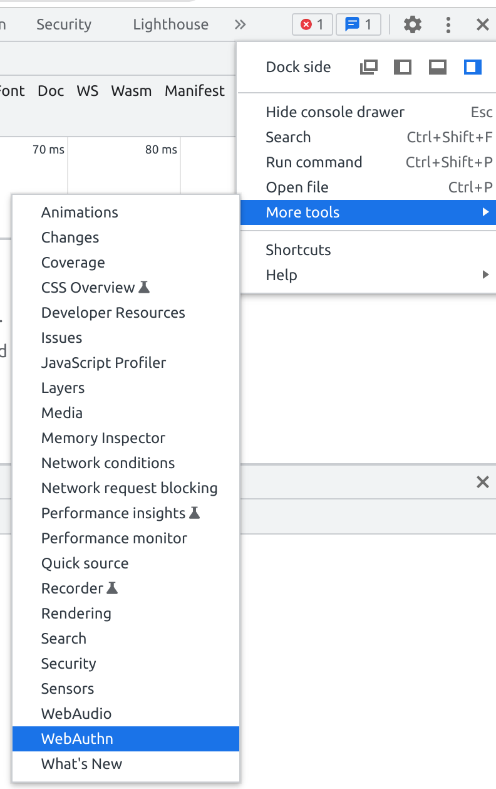

doorway
-------

[webauthn](https://webauthn.guide/) example based on:

* https://grison.me/2020/04/23/webauthn-with-clojure/
* https://github.com/agrison/cljwebauthn

## test webauthn env chrome:

